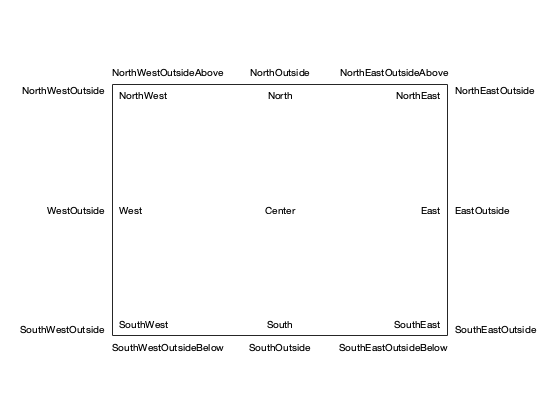
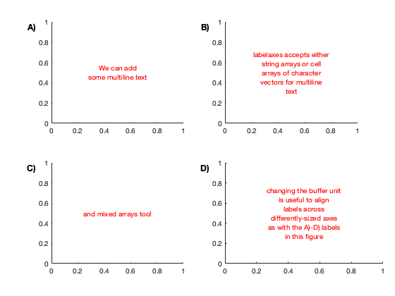

# labelaxes.m: Quick placement of text in or around a Matlab axis


Author: Kelly Kearney


This repository includes the code for the `labelaxes.m` Matlab function, along with all dependent functions required to run it.


This function places text in an axis based on location strings similar to those used by legend. It can be useful when labeling subaxes.


This function is based on the [textLoc](https://www.mathworks.com/matlabcentral/fileexchange/17151-textloc) function (written by Ben Barrowes), but with a few extra features for added flexibility: it allows for application of labels to multiple axes at once, and provides more flexibility when specifying the buffers.


## Contents

            
- Getting started        
- Syntax        
- Description        
- Examples        
- Example 1: Default locations        
- Example 2: Labeling subplots        
- Contributions

## Getting started


**Prerequisites**


This function is compatible with Matlab R2007a and later.


**Downloading and installation**


This code can be downloaded from [Github](https://github.com/kakearney/labelaxes-pkg/)


**Matlab Search Path**


The following folders need to be added to your Matlab Search path (via `addpath`, `pathtool`, etc.):


```matlab
labelaxes-pkg/labelaxes
```


## Syntax


```
htxt = labelaxes(ax, labels, location)
htxt = labelaxes(ax, labels, location, Name, Value, ...)
```


## Description


`htxt = labelaxes(ax, labels, location)` places the text in the string or cell array of character vectors `labels` on the respective axes `ax` in the location indicated by `location`. The `ax` and `labels` arrays can be any size but must include the same number of elements.  `location` can be any of the following (see example for default placement):


```
'North'                   inside plot box near top
'South'                   inside bottom
'East'                    inside right
'West'                    inside left
'Center'                  centered on plot
'NorthEast'               inside top right (default)
'NorthWest'               inside top left
'SouthEast'               inside bottom right
'SouthWest'               inside bottom left
'NorthOutside'            outside plot box near top
'SouthOutside'            outside bottom
'EastOutside'             outside right
'WestOutside'             outside left
'NorthEastOutside'        outside top right
'NorthWestOutside'        outside top left
'SouthEastOutside'        outside bottom right
'SouthWestOutside'        outside bottom left
'NorthEastOutsideAbove'   outside top right (above)
'NorthWestOutsideAbove'   outside top left (above)
'SouthEastOutsideBelow'   outside bottom right (below)
'SouthWestOutsideBelow'   outside bottom left (below)
```


`labelaxes(..., 'hbuffer', buf)`, `labelaxes(..., 'vbuffer', buf)` alter the default spacing between axis anchor point and the horizontally- and vertically-aligned side of each text label (not applicable to center- and middle-aligned locations). Default is 1/50.


`labelaxes(..., 'hbufferunt', unit)`, `labelaxes(..., 'hbufferunt', unit)` sets the unit used for the label. All text labels will be placed using normalized axes coordinates, but the buffer can be set using any valid axis units. Default is 'normalized'.


## Examples


## Example 1: Default locations


The default locations are as follows.


```matlab
hax=axes('position',[0.20.20.60.6],...'xtick',[],'ytick',[],'box','on');locs=[..."North""South""East""West""Center""NorthEast""NorthWest""SouthEast""SouthWest""NorthOutside""SouthOutside""EastOutside""WestOutside""NorthEastOutside""NorthWestOutside""SouthEastOutside""SouthWestOutside""NorthEastOutsideAbove""NorthWestOutsideAbove""SouthEastOutsideBelow""SouthWestOutsideBelow"];htxt=gobjects(size(locs));forii=1:length(locs)htxt(ii)=labelaxes(hax,locs(ii),locs(ii));end
```





## Example 2: Labeling subplots


This function is particularly useful when labeling multiple subplots at once. Note that it also supports multiline text, and accepts text property options.


```matlab
forii=1:4hax(ii)=subplot(2,2,ii);endhax(4).Position(3)=0.4;htxt=labelaxes(hax,["A)","B)","C)","D)"],'northwestoutside',...'fontweight','b','fontsize',12,'hbuffer',0.3,'hbufferunit','inch');hxt=labelaxes(hax,{["We can add","some multiline text"],...{'labelaxes accepts either',...'string arrays or cell',...'arrays of character',...'vectors for multiline',...'text'},'and mixed arrays too!',...["changing the buffer unit","is useful to align",..."labels across","differently-sized axes",..."as with the A)-D) labels""in this figure"]},'center',...'color',[100]);
```





## Contributions


Community contributions to this package are welcome!


To report bugs, please submit [an issue](https://github.com/kakearney/example-pkg/issues) on GitHub and include:


  - your operating system
  - your version of Matlab and all relevant toolboxes (type `ver` at the Matlab command line to get this info)
  - code/data to reproduce the error or buggy behavior, and the full text of any error messages received

Please also feel free to submit enhancement requests, or to send pull requests (via GitHub) for bug fixes or new features.


I do monitor the MatlabCentral FileExchange entry for any issues raised in the comments, but would prefer to track issues on GitHub.


<sub>[Published with MATLAB R2024a]("http://www.mathworks.com/products/matlab/")</sub>

